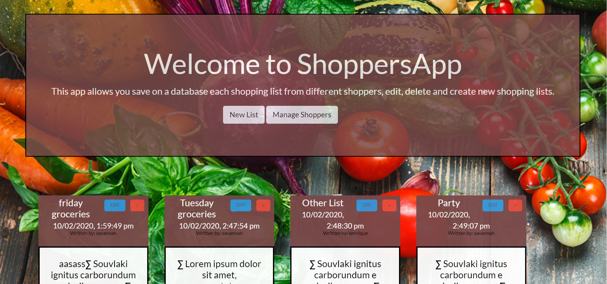
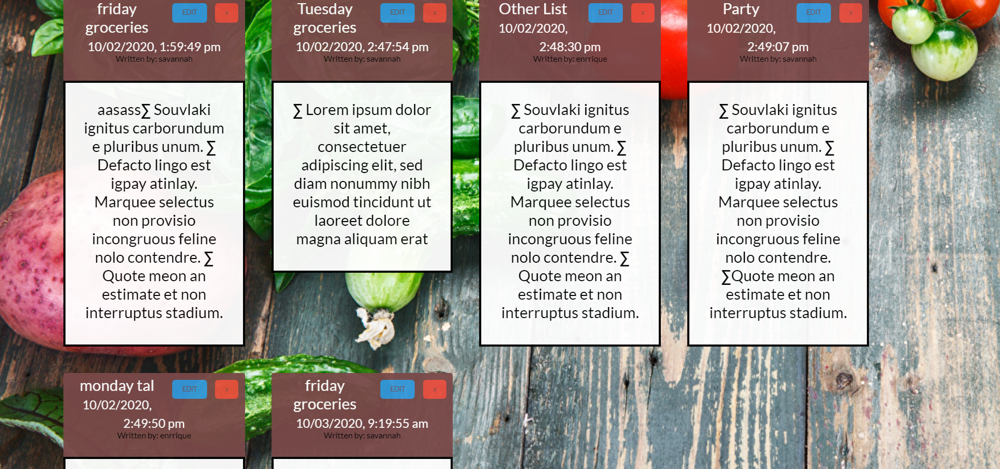
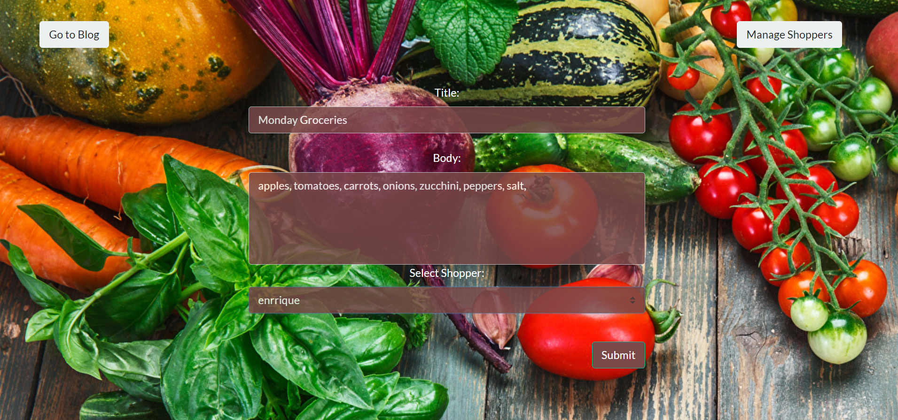
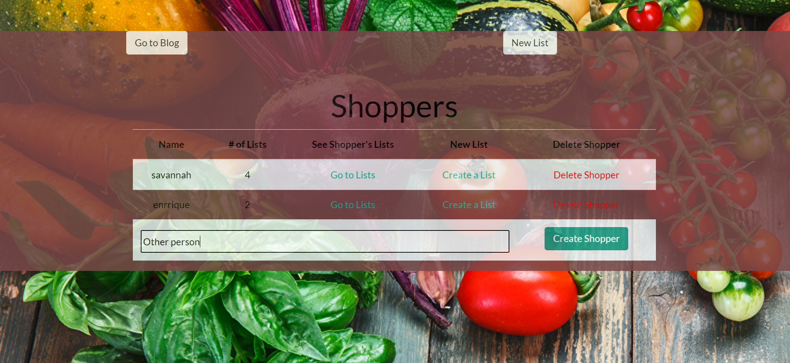

# Project-2.0.2
h1>Welcome to ShoppersApp</h1>

<h2>With this app you can create, modify or delete any shopping list and store it on a database</h2>

<h1>Deployment</h1>

Get online to  and create a shopper if you did not do it before, then create a title for your shopping list and save the content on a database, you also can modify and delete the lists any time 

  
  
  
  

  

  
  

<h1>Built With</h1>

Bootstrap - The css framework and mobile response used 
jQuery 
Express 
Sequelize - database 

<h1>Authors</h1>

Enrrique Pimentel -
Juan Rada -
See also the list of contributors who participated in this project.

<h1>License</h1>

This project is licensed under the GNU General Public License v3.0 - see the LICENSE.md file for details

